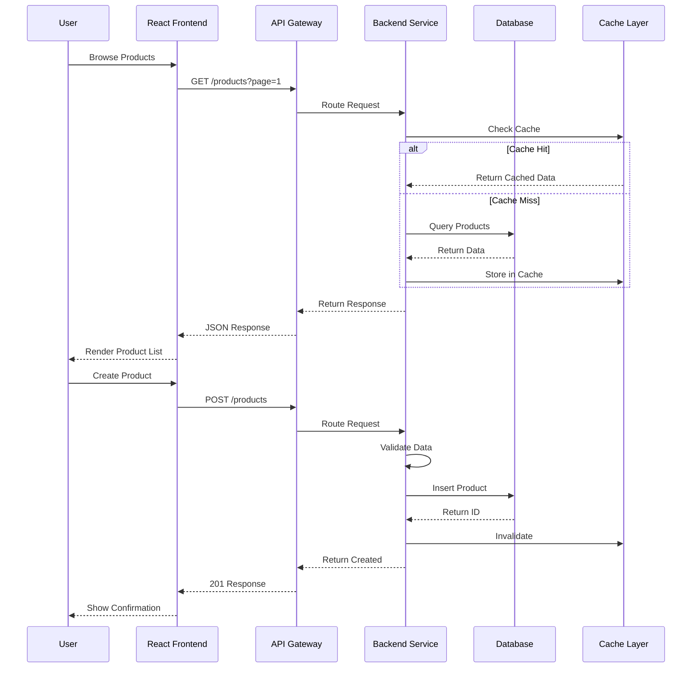

# Architecture Documentation

## System Overview

The Copilot Demo App is a multi-service architecture demonstrating different technology stacks with a unified React frontend. The system implements a Product Catalog Management feature with full CRUD operations, search, filtering, and validation capabilities.

## Components

### Frontend
- **frontend-react** — Vite + React SPA (runs on `http://localhost:5173`)
  - Product listing and search UI
  - Product creation and edit forms
  - Shopping cart and checkout flows
  - Responsive design with error handling

### Backend Services

#### 1. .NET 8 Service (Primary Catalog Service)
- **Service**: backend-dotnet
- **Port**: `http://localhost:5000`
- **Framework**: ASP.NET Core 8 Minimal APIs
- **Responsibilities**: 
  - **Primary source of truth** for product data
  - Product CRUD operations (Create, Read, Update, Delete)
  - Product status management (ACTIVE, INACTIVE, DISCONTINUED)
  - Inventory management and stock tracking
  - Database: PostgreSQL (product_catalog schema)
- **API Endpoints**: `/api/v1/products/*`

#### 2. Java Service (Search & Analytics)
- **Service**: backend-java
- **Port**: `http://localhost:8080`
- **Framework**: Spring Boot 3.x
- **Responsibilities**:
  - Read-only product queries (no mutations)
  - Advanced search and filtering with Elasticsearch
  - Category and tag-based navigation
  - Analytics and reporting
  - Database: MongoDB read-replica of .NET service (eventual consistency)
- **API Endpoints**: `/api/v1/search/*`, `/api/v1/analytics/*`

#### 3. Python Service (Validation & Integration)
- **Service**: backend-python
- **Port**: `http://localhost:8000`
- **Framework**: FastAPI + Uvicorn
- **Responsibilities**:
  - Request/response validation and transformation
  - Data enrichment (recommendations, related products)
  - Integration with external services
  - **Does NOT have independent data storage** (read-only access)
- **API Endpoints**: `/api/v1/validate/*`, `/api/v1/enrich/*`
- **No Database Direct Access** — queries .NET service only

### Data Flow & Consistency

**Primary Write Path**: React Frontend → API Gateway → .NET Service (DB1)
- All write operations route to .NET service exclusively
- Changes immediately visible in .NET database

**Read Path**: React Frontend → API Gateway → Any Service
- Read requests can route to .NET (authoritative) or Java (cached/indexed)
- Python service does not serve product data directly

**Data Synchronization Strategy**:
- **.NET (PostgreSQL)**: Single source of truth, writes committed synchronously
- **Java (MongoDB)**: Read-replica updated via event stream or scheduled sync (5-minute lag acceptable)
- **Python**: Stateless validation layer, no persistent data
- **Redis Cache**: Invalidated on every write to .NET service, TTL: 5 minutes for reads

**Conflict Resolution**:
- If Java read-replica is stale, client receives data with `X-DataFreshness: stale` header
- Python service detects inconsistencies during validation and re-syncs from .NET

## API Gateway Layer

**Implementation**: NGINX Reverse Proxy (localhost:3000)
- Routes all frontend requests to appropriate backend service
- Handles CORS headers and SSL termination
- Enforces rate limiting (1000 req/min per client)
- Logs all requests with X-Request-ID for tracing

**Routing Rules**:
```
POST   /api/v1/products        → .NET (localhost:5000)
PATCH  /api/v1/products/:id    → .NET (localhost:5000)
PUT    /api/v1/products/:id    → .NET (localhost:5000)
DELETE /api/v1/products/:id    → .NET (localhost:5000)

GET    /api/v1/products        → .NET (localhost:5000) [authoritative]
GET    /api/v1/products/:id    → .NET (localhost:5000) [authoritative]

GET    /api/v1/search          → Java (localhost:8080) [indexed/cached]
GET    /api/v1/search/advanced → Java (localhost:8080) [Elasticsearch]

POST   /api/v1/validate        → Python (localhost:8000)
GET    /api/v1/enrich/:id      → Python (localhost:8000)
```

**CORS Configuration**:
```
Access-Control-Allow-Origin: http://localhost:5173
Access-Control-Allow-Methods: GET, POST, PUT, PATCH, DELETE
Access-Control-Allow-Headers: Content-Type, Authorization, X-Request-ID
Access-Control-Max-Age: 3600
```

## System Architecture Diagram

```mermaid
graph TB
    subgraph Client["Client Layer"]
        UI["React Frontend<br/>localhost:5173"]
    end
    
    subgraph Gateway["API Gateway Layer"]
        NGINX["NGINX<br/>localhost:3000<br/>Routing & CORS"]
    end
    
    subgraph Services["Backend Services"]
        NET["ASP.NET 8<br/>localhost:5000<br/>PRIMARY: Write & Authoritative Read"]
        JAVA["Spring Boot<br/>localhost:8080<br/>Search & Analytics (read-only)"]
        PY["FastAPI<br/>localhost:8000<br/>Validation & Enrichment"]
    end
    
    subgraph Data["Data Layer"]
        DB1[("PostgreSQL<br/>Primary DB<br/>.NET Writes")]
        DB2[("MongoDB<br/>Read-Replica<br/>5-min sync")]
        CACHE["Redis Cache<br/>5-min TTL<br/>Auto-invalidate on write"]
    end
    
    subgraph Sync["Sync Layer"]
        EVENT["Event Stream<br/>Change Data Capture"]
    end
    
    UI -->|All requests| NGINX
    
    NGINX -->|Write (POST,PUT,PATCH,DELETE)| NET
    NGINX -->|Read (GET /products)| NET
    NGINX -->|Search (GET /search)| JAVA
    NGINX -->|Validate| PY
    
    NET -->|Read/Write| DB1
    NET -->|Invalidate| CACHE
    PY -->|Query| NET
    
    JAVA -->|Replicate| DB2
    JAVA -->|Query| CACHE
    JAVA -->|Listen| EVENT
    
    DB1 -->|CDC Stream| EVENT
    EVENT -->|Update| DB2
```

## Product Data Model

### Product Entity

```json
{
  "id": "uuid",
  "name": "string (1-100 chars)",
  "description": "string (0-500 chars)",
  "price": "decimal (> 0)",
  "category": "string (1-50 chars)",
  "stockQuantity": "integer (>= 0)",
  "sku": "string (unique)",
  "images": [
    {
      "url": "string",
      "alt": "string",
      "primary": "boolean"
    }
  ],
  "attributes": {
    "color": "string",
    "size": "string",
    "weight": "string"
  },
  "status": "enum (ACTIVE, INACTIVE, DISCONTINUED)",
  "createdAt": "ISO8601 timestamp",
  "updatedAt": "ISO8601 timestamp",
  "createdBy": "string (user ID)",
  "updatedBy": "string (user ID)"
}
```

### Product Validation Rules

| Field | Type | Required | Constraints |
|-------|------|----------|-------------|
| id | UUID | Auto | Unique, immutable |
| name | String | Yes | 1-100 chars, non-empty |
| price | Decimal | Yes | > 0, max 2 decimals |
| description | String | No | Max 500 chars |
| category | String | Yes | 1-50 chars |
| stockQuantity | Integer | No | >= 0, default 0 |
| sku | String | Yes | Unique, alphanumeric |
| status | Enum | Yes | ACTIVE, INACTIVE, DISCONTINUED |

## API Design

### Base URLs
- .NET: `http://localhost:5000/api`
- Java: `http://localhost:8080/api`
- Python: `http://localhost:8000/api`

### Product Endpoints

#### 1. Create Product
```
POST /products
Content-Type: application/json

Request:
{
  "name": "Laptop",
  "price": 999.99,
  "category": "Electronics",
  "description": "High-performance laptop",
  "stockQuantity": 50,
  "sku": "LAPTOP-001"
}

Response: 201 Created
{
  "id": "550e8400-e29b-41d4-a716-446655440000",
  "name": "Laptop",
  "price": 999.99,
  "category": "Electronics",
  "description": "High-performance laptop",
  "stockQuantity": 50,
  "sku": "LAPTOP-001",
  "status": "ACTIVE",
  "createdAt": "2026-01-13T10:00:00Z",
  "updatedAt": "2026-01-13T10:00:00Z"
}
```

#### 2. Get All Products (with Pagination)
```
GET /products?page=1&pageSize=20&sortBy=name&sortOrder=asc

Response: 200 OK
{
  "data": [
    { /* product objects */ }
  ],
  "pagination": {
    "page": 1,
    "pageSize": 20,
    "totalCount": 150,
    "totalPages": 8
  },
  "_metadata": {
    "cached": true,
    "cacheAge": "120s",
    "source": "postgresql"
  }
}

Route: localhost:3000/api/v1/products → .NET Service (localhost:5000)
Note: Returns from .NET service (authoritative source)
```

#### 3. Get Product by ID
```
GET /products/{productId}

Response: 200 OK
{ /* product object */ }

Response: 404 Not Found
{
  "error": "Product not found",
  "code": "PRODUCT_NOT_FOUND"
}
```

#### 4. Search Products (Java Service)
```
GET /search?query=laptop&category=Electronics&minPrice=500&maxPrice=1500&inStock=true

Response: 200 OK
{
  "data": [
    { /* product objects from Elasticsearch index */ }
  ],
  "pagination": {
    "page": 1,
    "pageSize": 20,
    "totalCount": 5,
    "totalPages": 1
  },
  "_metadata": {
    "searchTime": "45ms",
    "source": "elasticsearch",
    "dataFreshness": "current"
  }
}

Route: localhost:3000/api/v1/search → Java Service (localhost:8080)
```

**Search Endpoint Details**:
- Routes to **Java Service only** (not .NET)
- Uses Elasticsearch for sub-second full-text search
- Supports faceted filtering by category, price range, stock status
- Does NOT support CREATE/UPDATE/DELETE operations
- Returns metadata about search performance and data freshness

#### 5. Update Product
```
PUT /products/{productId}
Content-Type: application/json

Request:
{
  "name": "Laptop Pro",
  "price": 1199.99,
  "stockQuantity": 45
}

Response: 200 OK
{ /* updated product object */ }
```

#### 6. Partial Update Product
```
PATCH /products/{productId}
Content-Type: application/json

Request:
{
  "stockQuantity": 45
}

Response: 200 OK
{ /* updated product object */ }
```

#### 7. Delete Product
```
DELETE /products/{productId}

Response: 204 No Content
```

#### 8. Soft Delete Product
```
PATCH /products/{productId}/status
Content-Type: application/json

Request:
{
  "status": "INACTIVE"
}

Response: 200 OK
{ /* product object with updated status */ }
```

### Error Response Format
```json
{
  "error": "string (user-friendly message)",
  "code": "string (error code)",
  "details": {
    "field": ["validation error message"]
  },
  "timestamp": "ISO8601 timestamp",
  "path": "string (API endpoint)"
}
```

### Common Error Codes
| Code | HTTP Status | Description |
|------|------------|-------------|
| VALIDATION_ERROR | 400 | Field validation failed |
| PRODUCT_NOT_FOUND | 404 | Product ID doesn't exist |
| DUPLICATE_SKU | 409 | SKU already exists |
| INVALID_PRICE | 400 | Price validation failed |
| UNAUTHORIZED | 401 | Missing/invalid authentication |
| FORBIDDEN | 403 | Insufficient permissions |
| RATE_LIMIT_EXCEEDED | 429 | Rate limit of 1000 req/min exceeded |
| SERVICE_UNAVAILABLE | 503 | Backend service unreachable |
| DATA_INCONSISTENCY | 409 | Write conflict (concurrent update) |
| INTERNAL_ERROR | 500 | Server error |

## Request/Response Headers

### Required Headers
```
Content-Type: application/json
Accept: application/json
```

### Optional Headers
```
Authorization: Bearer {token}
X-Request-ID: {uuid}
X-API-Version: v1
```

### Response Headers
```
X-Request-ID: {uuid}
X-RateLimit-Limit: 1000
X-RateLimit-Remaining: 999
X-RateLimit-Reset: {timestamp}
Cache-Control: max-age=300
```

## Performance Requirements

### Response Time SLOs (95th Percentile)
| Operation | Source | Cached | Target |
|-----------|--------|--------|--------|
| GET (single) | .NET | Yes | < 100ms |
| GET (single) | .NET | No | < 250ms |
| GET (list) | .NET | Yes | < 200ms |
| GET (list) | .NET | No | < 500ms |
| Search | Java/ES | Yes | < 100ms |
| Search | Java/ES | No | < 800ms |
| POST | .NET | - | < 500ms |
| PUT/PATCH | .NET | - | < 500ms |
| DELETE | .NET | - | < 300ms |

### Throughput Requirements
- Concurrent users: 100
- Requests per minute: 1000
- Page size range: 10-100 items

## Data Flow Diagram



## Technology Stack Summary

| Layer | Technology | Version |
|-------|-----------|---------|
| Frontend | React | 18+ |
| Frontend Build | Vite | Latest |
| Backend (.NET) | ASP.NET Core | 8.0 |
| Backend (Java) | Spring Boot | 3.x |
| Backend (Python) | FastAPI | 0.100+ |
| API Server (Python) | Uvicorn | Latest |
| Database | PostgreSQL/MongoDB | Latest |
| Cache | Redis | 7.0+ |
| HTTP | REST | JSON |
| Authentication | Bearer Token | JWT |

## Deployment Considerations

- Each backend service runs independently on different ports
- Frontend communicates with backend via HTTP REST APIs
- Load balancing distributes requests across services
- Database connections use connection pooling
- Caching layer reduces database load
- CORS configuration required for frontend-backend communication

## Development Workflow

1. Start each backend service in separate terminal
2. Start frontend dev server
3. Use API client (Postman, VS Code REST) for testing
4. Logs available in each service's console output
5. Hot-reload enabled for frontend development

