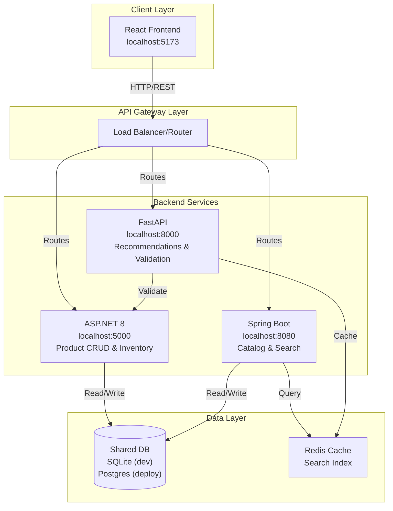
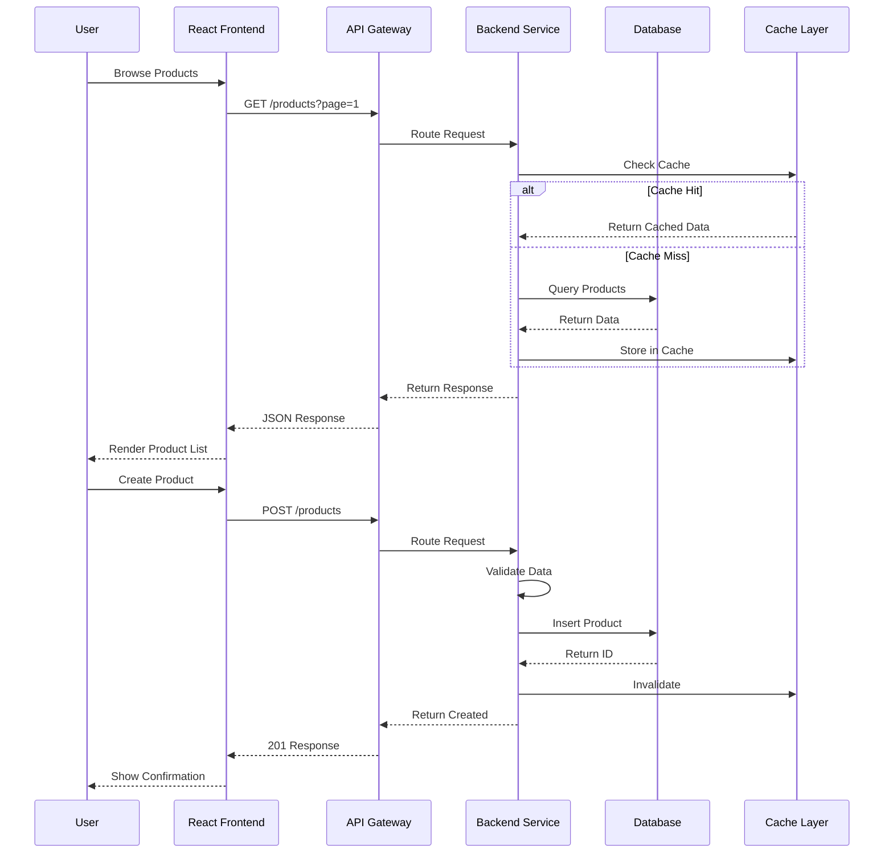

# Architecture Documentation

## System Overview

The Copilot Demo App is a multi-service architecture demonstrating different technology stacks with a unified React frontend. The system implements a Product Catalog Management feature with full CRUD operations, search, filtering, and validation capabilities.

## Components

### Frontend

- **frontend-react** — Vite + React SPA (runs on `http://localhost:5173`)
  - Product listing and search UI
  - Product creation and edit forms
  - Shopping cart and checkout flows
  - Responsive design with error handling

### Backend Services

#### 1. .NET 8 Service

- **Service**: backend-dotnet
- **Port**: `http://localhost:5000`
- **Framework**: ASP.NET Core 8 Minimal APIs
- **Responsibilities**:
  - Product CRUD operations
  - Inventory management
  - Order processing

#### 2. Java Service

- **Service**: backend-java
- **Port**: `http://localhost:8080`
- **Framework**: Spring Boot
- **Responsibilities**:
  - Product catalog queries
  - Advanced search and filtering
  - Analytics and reporting

#### 3. Python Service

- **Service**: backend-python
- **Port**: `http://localhost:8000`
- **Framework**: FastAPI + Uvicorn
- **Responsibilities**:
  - Product recommendations
  - Data validation and transformation
  - Integration services

## System Architecture Diagram



The .NET and Java services share a single database schema. For local development, both services use a shared SQLite file (for example `./shared-data/app.db`) with WAL enabled and a busy timeout to reduce lock contention. For deployed environments, both services target the same PostgreSQL database instance using the same schema and migration history.

## Product Data Model

### Product Entity

```json
{
  "id": "uuid",
  "name": "string (1-100 chars)",
  "description": "string (0-500 chars)",
  "price": "decimal (> 0)",
  "category": "string (1-50 chars)",
  "stockQuantity": "integer (>= 0)",
  "sku": "string (unique)",
  "images": [
    {
      "url": "string",
      "alt": "string",
      "primary": "boolean"
    }
  ],
  "attributes": {
    "color": "string",
    "size": "string",
    "weight": "string"
  },
  "status": "enum (ACTIVE, INACTIVE, DISCONTINUED)",
  "createdAt": "ISO8601 timestamp",
  "updatedAt": "ISO8601 timestamp",
  "createdBy": "string (user ID)",
  "updatedBy": "string (user ID)"
}
```

### Product Validation Rules

| Field         | Type    | Required | Constraints                    |
| ------------- | ------- | -------- | ------------------------------ |
| id            | UUID    | Auto     | Unique, immutable              |
| name          | String  | Yes      | 1-100 chars, non-empty         |
| price         | Decimal | Yes      | > 0, max 2 decimals            |
| description   | String  | No       | Max 500 chars                  |
| category      | String  | Yes      | 1-50 chars                     |
| stockQuantity | Integer | No       | >= 0, default 0                |
| sku           | String  | Yes      | Unique, alphanumeric           |
| status        | Enum    | Yes      | ACTIVE, INACTIVE, DISCONTINUED |

## API Design

### Base URLs

- .NET: `http://localhost:5000/api`
- Java: `http://localhost:8080/api`
- Python: `http://localhost:8000/api`

### Product Endpoints

#### 1. Create Product

```
POST /products
Content-Type: application/json

Request:
{
  "name": "Laptop",
  "price": 999.99,
  "category": "Electronics",
  "description": "High-performance laptop",
  "stockQuantity": 50,
  "sku": "LAPTOP-001"
}

Response: 201 Created
{
  "id": "550e8400-e29b-41d4-a716-446655440000",
  "name": "Laptop",
  "price": 999.99,
  "category": "Electronics",
  "description": "High-performance laptop",
  "stockQuantity": 50,
  "sku": "LAPTOP-001",
  "status": "ACTIVE",
  "createdAt": "2026-01-13T10:00:00Z",
  "updatedAt": "2026-01-13T10:00:00Z"
}
```

#### 2. Get All Products (with Pagination)

```
GET /products?page=1&pageSize=20&sortBy=name&sortOrder=asc

Response: 200 OK
{
  "data": [
    { /* product objects */ }
  ],
  "pagination": {
    "page": 1,
    "pageSize": 20,
    "totalCount": 150,
    "totalPages": 8
  }
}
```

#### 3. Get Product by ID

```
GET /products/{productId}

Response: 200 OK
{ /* product object */ }

Response: 404 Not Found
{
  "error": "Product not found",
  "code": "PRODUCT_NOT_FOUND"
}
```

#### 4. Search Products

```
GET /products/search?query=laptop&category=Electronics&minPrice=500&maxPrice=1500&inStock=true

Response: 200 OK
{
  "data": [
    { /* product objects */ }
  ],
  "pagination": {
    "page": 1,
    "pageSize": 20,
    "totalCount": 5,
    "totalPages": 1
  }
}
```

#### 5. Update Product

```
PUT /products/{productId}
Content-Type: application/json

Request:
{
  "name": "Laptop Pro",
  "price": 1199.99,
  "stockQuantity": 45
}

Response: 200 OK
{ /* updated product object */ }
```

#### 6. Partial Update Product

```
PATCH /products/{productId}
Content-Type: application/json

Request:
{
  "stockQuantity": 45
}

Response: 200 OK
{ /* updated product object */ }
```

#### 7. Delete Product

```
DELETE /products/{productId}

Response: 204 No Content
```

#### 8. Soft Delete Product

```
PATCH /products/{productId}/status
Content-Type: application/json

Request:
{
  "status": "INACTIVE"
}

Response: 200 OK
{ /* product object with updated status */ }
```

### Error Response Format

```json
{
  "error": "string (user-friendly message)",
  "code": "string (error code)",
  "details": {
    "field": ["validation error message"]
  },
  "timestamp": "ISO8601 timestamp",
  "path": "string (API endpoint)"
}
```

### Common Error Codes

| Code              | HTTP Status | Description                    |
| ----------------- | ----------- | ------------------------------ |
| VALIDATION_ERROR  | 400         | Field validation failed        |
| PRODUCT_NOT_FOUND | 404         | Product ID doesn't exist       |
| DUPLICATE_SKU     | 409         | SKU already exists             |
| INVALID_PRICE     | 400         | Price validation failed        |
| UNAUTHORIZED      | 401         | Missing/invalid authentication |
| FORBIDDEN         | 403         | Insufficient permissions       |
| INTERNAL_ERROR    | 500         | Server error                   |

## Request/Response Headers

### Required Headers

```
Content-Type: application/json
Accept: application/json
```

### Optional Headers

```
Authorization: Bearer {token}
X-Request-ID: {uuid}
X-API-Version: v1
```

### Response Headers

```
X-Request-ID: {uuid}
X-RateLimit-Limit: 1000
X-RateLimit-Remaining: 999
X-RateLimit-Reset: {timestamp}
Cache-Control: max-age=300
```

## Performance Requirements

### Response Time SLOs

| Operation    | Target   | Percentile |
| ------------ | -------- | ---------- |
| GET (single) | < 200ms  | 95th       |
| GET (list)   | < 500ms  | 95th       |
| POST         | < 500ms  | 95th       |
| PUT/PATCH    | < 500ms  | 95th       |
| DELETE       | < 500ms  | 95th       |
| Search       | < 1000ms | 95th       |

### Throughput Requirements

- Concurrent users: 100
- Requests per minute: 1000
- Page size range: 10-100 items

## Data Flow Diagram



## Technology Stack Summary

| Layer               | Technology                                          | Version |
| ------------------- | --------------------------------------------------- | ------- |
| Frontend            | React                                               | 18+     |
| Frontend Build      | Vite                                                | Latest  |
| Backend (.NET)      | ASP.NET Core                                        | 8.0     |
| Backend (Java)      | Spring Boot                                         | 3.x     |
| Backend (Python)    | FastAPI                                             | 0.100+  |
| API Server (Python) | Uvicorn                                             | Latest  |
| Database            | SQLite (dev), PostgreSQL (deploy)                   | Latest  |
| ORM (.NET)          | EF Core (Sqlite/Npgsql providers)                   | Latest  |
| ORM (Java)          | Spring Data JPA (SQLite dialect/PostgreSQL dialect) | Latest  |
| Cache               | Redis                                               | 7.0+    |
| HTTP                | REST                                                | JSON    |
| Authentication      | Bearer Token                                        | JWT     |

### Database Strategy (SQLite for local, PostgreSQL for deploy)

- Provider selection via environment: `DB_PROVIDER=sqlite|postgres` and a single `DB_CONNECTION_STRING` (or framework-specific equivalents). In Spring, prefer profiles (e.g., `SPRING_PROFILES_ACTIVE=dev-sqlite` vs `prod-pg`).
- Local: shared SQLite file at a stable path (e.g., `./shared-data/app.db`); enable WAL and set a busy timeout; ensure both services run on the same filesystem/volume so file locks work.
- Deploy: PostgreSQL with pooled connections; both services use the same schema and migrations; use SSL/TLS and managed backups.
- Portability constraints: avoid provider-specific types in the shared model for local runs (SQLite lacks rich types); Postgres-only features (jsonb, arrays, citext) should be optional or gated.

### Migration and Portability Notes

- Maintain provider-specific migrations: EF Core can keep separate migration assemblies for Sqlite vs Npgsql; Spring can use Flyway/Liquibase locations `db/migration/sqlite` and `db/migration/postgres`.
- Validate migrations in CI against both providers (SQLite for fast checks; ephemeral PostgreSQL container for deploy parity).
- Key differences to note: SQLite allows a single writer at a time; enable WAL to improve read concurrency. Postgres uses sequences; avoid assumptions about identity gaps. SQLite needs `PRAGMA foreign_keys=ON`; enforce UTC timestamps in both providers.

## Deployment Considerations

- Each backend service runs independently on different ports
- Frontend communicates with backend via HTTP REST APIs
- Load balancing distributes requests across services
- Database strategy: SQLite for local dev (shared file, WAL, busy timeout); PostgreSQL for deploy (managed instance, SSL, backups)
- Database connections use connection pooling
- Shared schema and migrations owned jointly by .NET and Java services (provider-specific migration sets)
- Caching layer reduces database load
- CORS configuration required for frontend-backend communication

## Development Workflow

1. Start each backend service in separate terminal
2. Start frontend dev server
3. Use API client (Postman, VS Code REST) for testing
4. Logs available in each service's console output
5. Hot-reload enabled for frontend development
